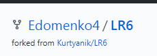
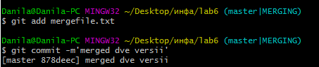

**Отчет по лабораторной работе №6** 

**По курсу: Основы программирования**

**Выполнил студент гр. 4916 Д.А. Едоменко**

**Ход работы:**

На сайте GitHub сделал копию лабораторной работы https://github.com/Kurtyanik/LR6/

Далее, введя имя пользователя и email, настроил клиент

С помощью команды cd Desktop/инфа/lab6  перешёл в созданную папку lab6

Использовал команду git init чтобы инициализировать гит в данной папке

Командой _git remote add origin_ связал папку с удалённым репозиторием и командой _git clone_ клонировал удаленный репозиторий на компьютер на сайте GitHub

Через интерфейс GitHub добавил новый файл _fail1.txt_ в удалённый репозиторий и добавил его в ветку **master**

Используя команду _git pull origin master_ загрузил изменения из удалённого репозитория в локальный

Командой _git log_ получил список коммитов

Используя _git show_ получил  информацию о последнем изменении

Командой _git checkout -t branch1_ переключился на ветку **branch1**

Попытался сделать слияние веток **master** и **branch1**, но получил ошибку. В итоге, вручную изменил содержание файла mergefile.txt, устранив ошибку слияния и выполнил коммит

Выполнил слияние веток **master** и **branch1** с помощью команды _git merge branch1_ и удалил ветку **branch1** командой _git branch -d branch1_

Занес всё в удалённый репозиторий командой _git push origin master_ 

Добавил два новых файла. один из файлов на первом скриншоте не видно, так как по своей глупости я сделал сриншот уже после отката одного из файлов

Командой _git reset --hard HEAD~1_ выполнил откат последнего коммита, а именно добавления файла fail3.txt и занес изменённую ветку в удаленный репозиторий

Используя команду _git checkout -b account_ создал новую ветку **account**

С помощью команды _git add ._ подготовил все новые файлы в папке lab6 к добавлению и занес в удаленный репозиторий

Оформил отчёт в файле README.md, используя блокнот

Лог команд из папки **.git/logs**

Конечный результат команды _git log_

Все скриншоты лежат в папке **Screenshots**
